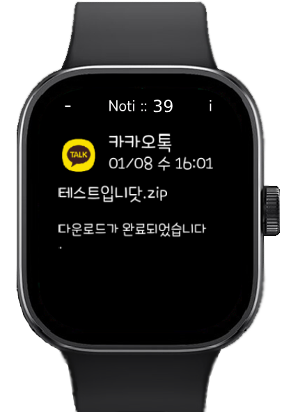

# Redmi Watch 5 Notification App (for All Languages)

###
###
## 0. Before Introduction
- The developer is not responsible for device malfunctions or any disadvantages resulting from installing these apps on the watch and phone.
- The author is not responsible for device malfunctions or any disadvantages resulting from installing the modified Mi Fitness app on a mobile phone.

> [-> 한국어 설명서](./README_KR.md)

###
###
## 1. Watch App Install (.rpk)
### 1.1. Download latest app( org.duckdns.sunga.rw5noti.~~~.rpk ) from releases (tag:rpk)
[-> Link <-](https://github.com/maga32/RedmiWatch5-Noti/releases/tag/rpk)

### 1.2. To install rpk file, use [1.2.1. patched MiFitness App](#121-Use-patched-MiFitness-App) OR [1.2.2. Notify for Xiaomi App](#122-Use-Notify-for-Xiaomi-App)

### 1.2.1. Use patched MiFitness App

> - Install patched MiFitness App [-> Link <-](https://github.com/maga32/RedmiWatch5-Noti/releases/tag/MiFitnessPatched)
> - Go to Profile -> About this app -> User Agreement
> - Input package name : org.duckdns.sunga.rw5noti
> - Click "install third app" and choose downloaded .rpk file

### 1.2.2. Use Notify for Xiaomi App

> - Install "Notify for Xiaomi" App from the Play Store
> - Sync watch with Notify for Xiaomi app
> - Device tap -> firmware update -> Third party app
> - Choose downloaded .rpk file
> - !!!! important !!!! After installation, you should sync the watch with the "MiFitness App" again.

### 1.3. After installing the rpk file, "Noti" app will appear on the watch

###
###
## 2. Android App Install (.apk)
### 2.1. Download latest app( RW5Noti.~~~.apk ) from releases (tag:apk)
[-> Link <-](https://github.com/maga32/RedmiWatch5-Noti/releases/tag/apk)

### 2.2. Install it from Android Phone.
> *The watch must be synced with "MiFitness" app

### 2.3. Grant all permissions requested by the app

### 2.4. Check the Connected watch and Request watch permission.

### 2.5. After clicking the "Notification Test" to confirm normal operation, check the list of apps to receive notifications.
