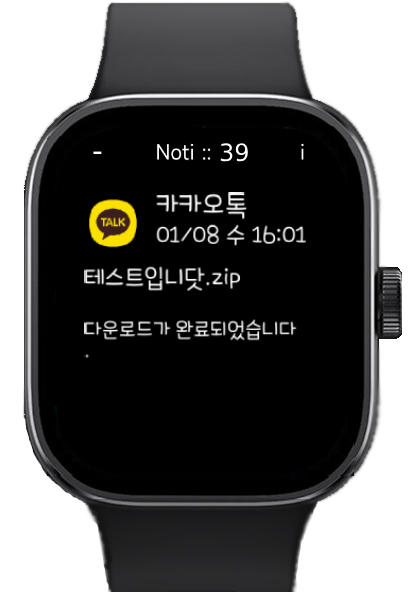

# Redmi Watch 5 알림앱 (모든 언어 지원)

###
###
## 0. 들어가기에 앞서
- 해당 앱을 시계와 휴대폰에 설치함으로써 발생하는 기기 오작동 및 모든 불이익에 대해 개발자는 책임을 지지 않습니다.
- 해당 앱을 시계에 설치함으로써 발생하는 기기 오작동 및 모든 불이익에 대해 개발자는 책임을 지지 않습니다.

> [-> English Docs](./README.md)

###
###
## 1. 워치 앱 설치 (.rpk)
### 1.1. 최신 앱(org.duckdns.sunga.rw5noti.~~~.rpk)을 Releases(tag:rpk)에서 다운로드하세요.
[-> 링크 <-](https://github.com/maga32/RedmiWatch5-Noti/releases/tag/rpk)

### 1.2. rpk 파일을 설치하려면 [1.2.1. 수정된 MiFitness 앱](#121-수정된-MiFitness-앱-사용) 또는 [1.2.2. Notify for Xiaomi 앱](#122-Notify-for-Xiaomi-앱-사용)을 사용하세요.

### 1.2.1. 수정된 MiFitness 앱 사용

> - 수정된 MiFitness 앱 설치 [-> 링크 <-](https://github.com/maga32/RedmiWatch5-Noti/releases/tag/MiFitnessPatched)
> - Profile -> About this app -> User Agreement 로 이동
> - 패키지 이름 입력: org.duckdns.sunga.rw5noti
> - "install third app"를 클릭하고 다운로드한 .rpk 파일 선택

### 1.2.2. Notify for Xiaomi 앱 사용

> - Play 스토어에서 "Notify for Xiaomi" 앱 설치
> - Notify for Xiaomi 앱과 워치 동기화
> - Device 탭 -> 펌웨어 업데이트 -> Third party app 선택
> - 다운로드한 .rpk 파일 선택
> - !!!! 중요 !!!! 설치 후, 반드시 "MiFitness 앱"과 워치를 다시 동기화해야 합니다.

### 1.3. rpk 파일 설치 후, "Noti" 앱이 워치에 나타납니다.

###
###
## 2. 안드로이드 앱 설치 (.apk)
### 2.1. 최신 앱(RW5Noti.~~~.apk)을 Releases(tag:apk)에서 다운로드하세요.
[-> 링크 <-](https://github.com/maga32/RedmiWatch5-Noti/releases/tag/apk)

### 2.2. Android 기기에 설치하세요.
> *워치는 반드시 "MiFitness" 앱과 동기화되어야 합니다.

### 2.3. 앱에서 요청하는 모든 권한을 허용하세요.

### 2.4. 연결된 워치를 확인하고 워치 권한을 요청하세요.

### 2.5. "Notification Test" 버튼을 눌러 정상 작동을 확인한 후, 알림을 받을 앱 목록을 확인하세요.